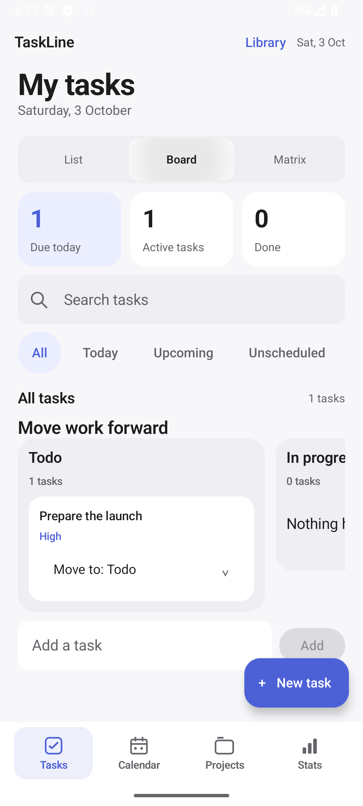
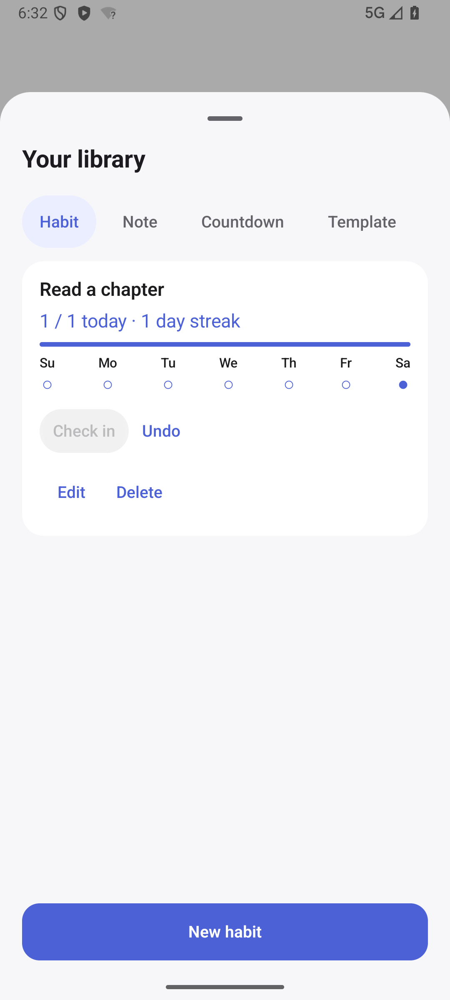
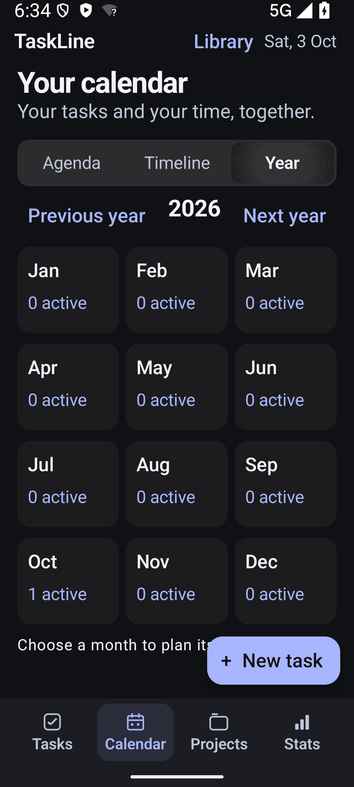

# TaskLine

**Plan your work. Build daily habits. Keep your data offline.**

TaskLine is a native Android task and project planner built with Kotlin, Jetpack Compose, and Room. It brings tasks, calendars, habits, notes, and focus sessions into an original iOS-inspired interface with light and dark themes.

**Android 8.0+ · Offline · Development preview**

[Download APK](https://github.com/zack005-design/TaskLine/releases/tag/dev-2026-10-03-integrated) · [User guide](docs/USAGE.md) · [Verification](docs/VERIFICATION.md) · [Report an issue](https://github.com/zack005-design/TaskLine/issues)

## Preview

| Task board | Habits | Year planner · dark mode |
| :---: | :---: | :---: |
|  |  |  |

Actual emulator captures from the preceding offline build, using isolated test fixtures.

## Features

| Area | What you can do |
| --- | --- |
| Tasks & projects | Organize tasks with subtasks, tags, priorities, progress, project colors, search, and date/status filters. Switch between list, status board, and priority/deadline matrix. |
| Planning | Use month/week calendars, agenda, a bounded 14-day timeline, and a year overview. Set due times, durations, fixed deadlines, recurrence, and local reminders. Review English smart-entry suggestions before applying them. |
| Library | Track daily habits and streaks, write notes, create countdowns, reuse task-title templates, and save text/priority/status filters. |
| Task context | Add local comments and file attachments; inspect activity recorded from this version onward. |
| Focus & statistics | Run a persistent focus timer with selectable duration and pause/resume. View completion estimates, streaks, and project progress. |
| Appearance & widgets | Choose six accent palettes and system/light/dark modes. Add Up next and Daily rituals home-screen widgets. |
| Sample data | Use Tools → Add test data to add editable examples across tasks, projects, planning, and Library. Repeated clicks preserve existing samples. |
| Import & backup | Import phone calendars or `.ics` files once. Export and restore validated JSON backups including library records and attachments. |

TaskLine has no Internet permission, cloud account, subscription, or synchronization service. Calendar access is read-only and requested when you choose phone-calendar import. See [feature scope and boundaries](docs/OFFLINE_FEATURES.md) for exact behavior.

## Install

1. Open the [3 October 2026 development release](https://github.com/zack005-design/TaskLine/releases/tag/dev-2026-10-03-integrated).
2. Download `TaskLine-2026-10-03-integrated-debug.apk` and its `.sha256` checksum.
3. Open the APK on Android 8.0 or newer. Allow installation from your browser or file manager if prompted.

This APK is development-signed. Before upgrading, export a backup through **Tools → Backup & restore**. If Android reports an incompatible signing certificate, keep your backup before uninstalling; uninstalling removes local app data.

Verify the download on Windows:

```powershell
Get-FileHash ./TaskLine-2026-10-03-integrated-debug.apk -Algorithm SHA256
```

Expected SHA-256:

```text
9DF1BC52B4E5A6497C96884AF35EAC7D7F32CFC06968721E2777219B9360EDE2
```

## Build

Install Android Studio and SDK Platform 36. The included Gradle 9.6 wrapper uses the checked-in Java 25 daemon toolchain configuration; app bytecode targets Java 17. Configure your SDK using Android Studio or an untracked `local.properties` file.

```powershell
./gradlew.bat :app:assembleDebug :app:testDebugUnitTest :app:lintDebug --max-workers=2

# With a connected emulator or Android device:
./gradlew.bat :app:connectedDebugAndroidTest --max-workers=2
```

On macOS/Linux, use `./gradlew` with the same tasks. The debug APK is produced at `app/build/outputs/apk/debug/app-debug.apk`. Application ID: `com.example.taskfoundation`; development version: `1.0` (code `1`).

## Verification

The released offline build was verified on 3 October 2026:

- **25 JVM tests** and **44 Android instrumentation tests** passed on an Android 16 / API 36 emulator.
- **6 targeted tests** passed in dark mode at 150% text size.
- Debug app/test builds and lint passed with **zero lint errors and 31 warnings**.
- The release APK checksum matches the tested app build.

The sample-data flow also passed an automated smoke test with TalkBack enabled. Physical-device behavior, a full manual TalkBack audit, production signing, and store distribution remain unverified. Background delivery and widget refresh timing depend on Android. Completion charts estimate dates from task updates. See the [full verification record](docs/VERIFICATION.md).

## Repository layout

```text
TaskLine/
├── app/
│   ├── schemas/               Versioned Room migration schemas
│   └── src/
│       ├── main/              Kotlin source, manifest, and Android resources
│       ├── test/              JVM unit tests
│       └── androidTest/       Database, UI, and widget instrumentation tests
├── docs/
│   ├── screenshots/           Selected verified app captures
│   ├── DESIGN.md              Visual system and component conventions
│   ├── OFFLINE_FEATURES.md    Feature scope and remaining differences
│   ├── USAGE.md               Tasks, planning, import, and backup guide
│   └── VERIFICATION.md        Results, evidence, and known limits
├── gradle/                    Wrapper and daemon toolchain configuration
├── build.gradle.kts          Shared plugin versions
├── settings.gradle.kts       Repository and module configuration
└── README.md
```

Within `app/src/main/java/com/example/taskfoundation/`, `domain` holds task models and scheduling rules; `data` owns Room persistence and portable backups; `calendar`, `reminders`, and `focus` own their platform behavior; `ui` contains Compose screens and ViewModels; `widget` contains native RemoteViews providers. Bundled animation provenance is recorded in [app/EMPTY_STATE_ASSETS.md](app/EMPTY_STATE_ASSETS.md).

APKs and checksums are distributed as release assets. Generated builds, caches, local configuration, signing material, and workspace recovery files are excluded from Git.

## Contributing

Open an [issue](https://github.com/zack005-design/TaskLine/issues) with reproduction steps or a proposed change. Preserve offline behavior and non-destructive migrations. Include relevant unit/device verification with a pull request and keep lint free of errors. Review the [design conventions](docs/DESIGN.md) before changing presentation.
